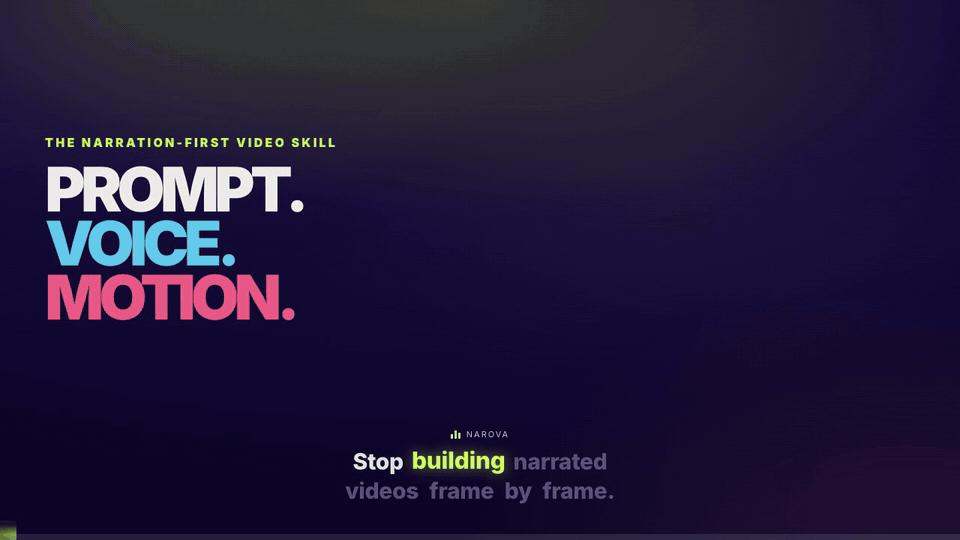

<div align="center">

# narova

**You write a prompt. narova makes the video.**

A skill your AI agent reads — Claude Code, Codex, Cursor, Kimi Code — that turns
prompts, scripts, web pages, and real product walkthroughs into narrated,
captioned video. Rendered on your machine.

[](./LICENSE)
[](./package.json)
[](https://ammar-hasan.github.io/narova/)

<a href="assets/narova-skill-reel.mp4">
  
</a>

*This 30-second reel was made by narova, about narova. [Watch it with sound](assets/narova-skill-reel.mp4) · [Live site](https://ammar-hasan.github.io/narova/)*

</div>

## Why narova

- **Two voices, one conversation** — local-first neural TTS dialogue, with optional registered providers when a project needs them. Give each speaker a color; narova writes the banter and the timing.
- **Karaoke captions** — every word lights up exactly as it's spoken, in the speaker's color. No manual timing, ever.
- **Cue-timed reveals** — elements stay hidden until the voice reaches them. Visuals land on the beat.
- **Two free local renderers** — keep unrestricted HTML/CSS and Studio in
  HyperFrames, or select Narova No-Browser for deterministic Skia + FFmpeg output
  on machines where no browser is available. No render service or fee.
- **Real product walkthroughs** — explore a website/app semantically, record
  cursor-guided actions on narration beats, frame or full-bleed the real UI,
  then layer captions, callouts, branding, music, and SFX around it.
- **Urdu-aware dialogue** — native `۔` and `؟` punctuation split sentence audio and timing correctly. For meaningful Urdu scripts, Narova can delegate dialogue polishing to the optional [`urdu-voice-director`](https://github.com/ammar-hasan/urdu-voice-director) skill.
- **Local-first, extensible by choice.** — ffmpeg, rendering, and the four built-in TTS backends run on your machine. Optional cloud voices execute only after explicit provider registration. Model downloads, stock assets, HyperFrames, and external providers need network access when used.

## Install

narova is a **skill** — the whole product lives in `skills/narova/`, and any agent
that reads skills can use it:

[](https://skills.sh/ammar-hasan/narova)

```bash
npx skills add ammar-hasan/narova --skill narova -g
# check for updates: npx skills update narova -g (only when you're ready — upgrading replaces the skill files)
```

## Quickstart

Once the skill is installed, ask your agent for the video in normal language.
Narova supports different starting points:

- **Idea:** “Make a 45-second vertical explainer about why starting small makes
  habits easier to keep. Make it warm and practical, and show me a preview
  before rendering.”
- **Product page:** “Turn this product page into a 30-second LinkedIn launch
  video: `[product URL]`. Lead with the user outcome and use the site's visual
  identity.”
- **Product walkthrough:** “Explore our demo account, then make a 45-second
  sales walkthrough that creates a project and shows the finished result.
  Narrate it, add word-synced captions and a CTA, and show me the preview.”
- **Research:** “Turn this paper into a 60-second explainer: `[paper URL]`.
  Separate the authors' findings from inference, cite the source on screen, and
  keep the language accessible.”
- **Repository:** “Read this repository and make a 45-second technical
  overview: `[repository URL]`. Explain what it does, show the architecture,
  and end with how to get started.”
- **Script or dialogue:** “Turn the script below into a fast two-host vertical
  reel. Keep the exchange natural, use distinct caption colors, and let the
  visuals change with each speaker.”

For URL-based prompts (product pages, articles, repos), the AI agent reads the
source, classifies it, extracts evidence, and writes the scene script. Narova's
`ingest` command handles the mechanical pass — fetching the HTML page, extracting
up to five images, and optionally capturing a browser screenshot — but
interpretation, repository analysis, PDF reading, and content selection remain
the agent's responsibility.

Your agent uses Narova to recommend the creative direction, create the editable
project, synthesize the narration, check the result, and show you a preview.
You direct revisions in the same conversation.

## Direct CLI control

The CLI is available when you want to inspect or automate each step yourself:

```bash
git clone https://github.com/ammar-hasan/narova.git && cd narova
npm link            # optional: gives you the `narova` command
narova doctor       # core tools + optional agent-browser walkthrough adapter

narova init generated/myreel && cd generated/myreel
narova synth        # makes narration + word timings
narova walkthrough capture   # product demos only: explicit, timed browser take
narova preview --detach   # review it in HyperFrames Studio
narova build --reuse      # after approval → out/video.mp4
```

You need: **ffmpeg**, **Node 18+**, **Python 3.10+**.

The first default `build` downloads a few things one time: it creates a Python venv
at `~/.narova/venv`, gets a voice model, and gets the HyperFrames CLI.
This can take a minute. It is not stuck.

For the no-browser renderer, run `npm install` once in this checkout
(standalone skill installs use `npm install --prefix <skill-dir>/tool`) and
verify it with `narova renderers doctor no-browser`.

Without `npm link`, run `node skills/narova/tool/bin/narova.js` instead of `narova`.

## The scene script

A project is a folder with one config file: `reel.config.mjs`.

```js
export default {
  title: "My Reel",
  renderer: "hyperframes",                    // default; or "no-browser"
  size: "16:9",                              // "16:9" | "1:1" | "9:16"
  assets: "assets",                          // copied into out/hf/assets/
  voices: {
    a: { backend: "piper", speaker: "en_US-ryan-high",         color: "#2ee6d6", label: "host · A" },
    b: { backend: "piper", speaker: "en_US-hfc_female-medium", color: "#ff7eb6", label: "host · B" },
  },
  theme: { accent: "#2ee6d6", bg: "#080d16" },   // optional
  timing: { gapSentence: 0.24, gapTurn: 0.44, lead: 0.16, tail: 0.58, tempo: 1.12 },
  scenes: [
    {
      id: "title",
      vo: [                                   // what is SPOKEN, in order
        { who: "a", text: "This is narova." },
        { who: "b", text: "Scenes in, video out. Let's go." },
      ],
      body: `<div class="s-title">
        <h1 class="display reveal">narova</h1>
        <p class="lede cue" data-cue="1">scenes in, video out</p>
      </div>`,
    },
  ],
}
```

The rules:

- `vo` is the spoken dialogue. Each turn is `{ who, text }`.
- `body` is HTML for the screen.
- `data-cue="1"` means: stay hidden until turn 1 starts. Counting starts at 0.
- `class="reveal"` means: animate in when the scene starts.
- You never set durations. The real audio decides how long each scene is.
- Styling is optional. Set colors with `theme`, or add a CSS file with
  `theme: { css: "theme.css" }`. Do not use `animation: ... infinite` in
  that CSS. The renderer jumps between frames, so looping animations break.
- Put logos, images, and local fonts in `assets/`; scene HTML and theme CSS
  reference them as `assets/...`. Inline SVG and small data URIs also work.
  Remote render-time files do not.

### Two local renderer providers

HyperFrames remains the default and full-fidelity path: arbitrary scene
HTML/CSS, the complete HyperFrames component/effects surface, browser Studio,
and captured walkthrough composition. Narova No-Browser is the free browserless
path: it draws a provider-neutral `scene.visual` tree with Skia and encodes it
with FFmpeg. Both run on your machine.

```js
{
  id: "title",
  vo: [{ who: "a", text: "One project, two local render paths." }],
  visual: {
    type: "stack",
    style: { direction: "column", padding: 56, gap: 18, background: "#080d16" },
    children: [
      { type: "text", text: "TWO LOCAL RENDERERS",
        style: { color: "#fff", fontSize: 64, fontWeight: 800 },
        enter: { type: "rise", at: { cue: 0 } } },
      { type: "progress", value: 1, fill: "#2ee6d6",
        style: { height: 10, background: "#243248", radius: 5 },
        animate: [{ property: "progress", from: 0, to: 1,
          at: 0.5, duration: 1.2, ease: "out" }] },
    ],
  },
}
```

A visual-only scene renders through either provider; Narova compiles the tree
to HTML for HyperFrames. A scene can also carry both `body` and `visual`:
HyperFrames uses the richer `body`, while no-browser requires and uses `visual`.
No-browser deliberately errors on HTML-only scenes instead of silently lowering
them. It supports stacks/groups, text, shapes, SVG paths, local raster/SVG
assets and fonts, OpenType-shaped RTL text (including Urdu/Arabic), full-frame
scene video, cue/keyframe motion, four transitions, captions, audio, snapshots,
and deliverables. It does not
claim parity for arbitrary HTML/CSS/JS, browser walkthrough framing, nested
video, shaders, 3D, particles, Lottie, or maps.

```bash
narova renderers list
narova build --renderer no-browser
narova preview --renderer no-browser   # writes out/preview-no-browser.mp4
```

See the exact [renderer capability contract](skills/narova/references/renderers.md).

### Product walkthroughs

[Watch the complete 83-second narrated walkthrough generated by this workflow.](assets/narova-product-walkthrough-demo.mp4)

The shipped showcase is one continuous browser take: create and configure a
project, search and reopen it, add and assign a task, enable an automation, and
invite a teammate. The local voiceover, karaoke captions, semantic actions,
cursor movement, and evidence frames all share the measured narration clock.

When the walkthrough cursor is enabled, semantic clicks now emit a short,
high-contrast ripple at the real target. It expands, fades, and disappears in
under half a second. [Watch the voiced, captioned real-browser click proof.](assets/narova-click-highlight-proof.mp4)

Product demos add a driver-neutral `walkthroughs` recipe and point scenes at
it. Narova uses optional `agent-browser` for the live exploration/capture pass,
then treats the WebM as a hashed source asset—ordinary builds never replay web
actions.

```js
export default {
  // voices, theme, …
  walkthroughs: {
    onboarding: {
      url: "https://app.example.com/projects",
      viewport: { w: 1440, h: 900 },
      ready: { text: "New project" },
      steps: [
        { at: { scene: "create", cue: 0, offset: 0.25 },
          action: "click",
          target: { role: "button", name: "New project" } },
        { at: { scene: "create", cue: 0, offset: 1.1 },
          action: "type",
          target: { label: "Project name" },
          value: "Launch plan" },
      ],
    },
  },
  scenes: [{
    id: "create",
    walkthrough: "onboarding", // or { id, layout: "full", fit: "cover" }
    vo: [{ who: "a", text: "Create a project and give it a clear name." }],
    body: `<p class="eyebrow reveal">From idea to workspace</p>`,
  }],
}
```

```bash
npm install -g agent-browser && agent-browser install  # optional adapter
narova walkthrough explore onboarding   # inspect real semantic controls
narova synth                             # establishes measured narration timing
narova walkthrough capture onboarding   # explicit live action + WebM/evidence
narova preview --detach
narova check --release
narova build --reuse
```

Recipes prefer roles, labels, test ids, and visible text over brittle
coordinates. Captures are invalidated when narration timing or actions change;
body/theme/window/full presentation edits reuse them. Authentication belongs in
a dedicated browser restore/profile, never a scripted password. See the full
[walkthrough contract](skills/narova/references/product-walkthroughs.md).
Hook variants keep separate captures: synth and capture the base plus each
walkthrough-bearing `--variant <id>` before `build --variants`.

## Voices

| Backend | Quality | Speed | Setup | Notes |
|---------|---------|-------|-------|-------|
| `piper` | good | fast | none (default) | small local voices |
| `xtts`  | higher | slow | `skills/narova/tool/setup.sh --xtts` | ~1.9GB model, 58 speakers |
| `qwen`  | high | slow | `skills/narova/tool/setup.sh --qwen` | ~1.2GB model, Apache 2.0, 9 speakers |
| `chatterbox` | voice cloning | slowest | `skills/narova/tool/setup.sh --chatterbox` | `speaker` = absolute path to a 10–20s recording; own venv, ~1GB model |

Pick voices that sound clearly different. Give each a `color`.
List voices with `narova voices list --backend <name>`.

### Optional external TTS

External services are separate companion skills, not Narova dependencies.
Narova only runs providers explicitly registered from a manifest:

```bash
narova providers add <provider-manifest.json>
narova providers doctor <name>
narova voices list --backend <name>
```

Use the registered name as a voice's `backend` and pass an opaque
`providerOptions` object. Keep credentials in the provider's required
environment variables—never in `reel.config.mjs`. Install only the companion
you want:

```bash
npx skills add ammar-hasan/narova --skill narova-elevenlabs -g
npx skills add ammar-hasan/narova --skill narova-openai -g
```

- [`narova-elevenlabs`](skills/narova-elevenlabs/) uses ElevenLabs voice IDs
  and account voice listing.
- [`narova-openai`](skills/narova-openai/) uses OpenAI's Speech API, defaults
  to steerable `gpt-4o-mini-tts`, recommends `marin` or `cedar`, accepts
  existing custom voice IDs, and requests lossless WAV directly.

## Commands

```
narova init <dir>     new project
narova check          validate the config (fast, no side effects)
narova synth          make the audio + word timings
narova compose        make the selected renderer project
narova walkthrough    explore/capture/status narrated product demos
narova shots          snapshot one QA frame per scene
narova build          synth + compose + render -> out/video.mp4
narova preview        HyperFrames Studio, or a no-browser draft MP4
narova preview --detach   keep Studio alive; stop with preview --stop
narova voices         list or download voices
narova providers      add/list/remove/doctor external TTS providers
narova renderers      list/doctor the two bundled local renderers
narova doctor         check your machine
```

Commands find the project from any folder inside it (they walk up to the
nearest `reel.config.*`). `check` also prints an estimated narration length,
so a target duration can be tuned before any audio exists.

Useful flags: `--backend <built-in-or-registered-provider>`,
`--renderer hyperframes|no-browser`, `--reuse` (keep old audio),
`--tempo`, `--size`, `--fps`, `--quality draft|standard|high`,
`--deliverables` (per-platform export presets via scale+pad — see
[`references/cli.md`](skills/narova/references/cli.md) for the full list).

## How it works

```
reel.config.mjs
   │
   ▼  synth      Python makes the speech and the word timings.
   │             Timings are scaled to match the real audio exactly.
   ▼  capture    Optional: agent-browser records declared product actions
   │             against measured narration anchors. Never runs in build.
   ▼  compose    narova writes the selected local renderer project:
   │             scene visuals, karaoke captions, reveals, one timeline.
   ▼  render     HyperFrames or No-browser renders the mp4 with audio inside.
   │
out/video.mp4
```

`out/`, `out/hf-*`, and `out/no-browser-*` are build folders. Never edit them.
The config file is the only source of truth.

## Repo layout

```
skills/narova/     the product: SKILL.md + references/ + tool/ (CLI, TTS, tests)
docs/              the marketing site (GitHub Pages) + /changelog
generated/narova-skill-reel/  flagship sample project (built from a plain-language prompt; more in generated/)
generated/         agent-created projects; source kept, out/ and build/ ignored
CHANGELOG.md       every notable change, version by version
SPEC.md            the contract
VISION.md          the product vision, mapped to where each point is implemented
LEARNINGS.md       bugs we hit and fixed — read before changing the pipeline
```

Run the tests: `npm test` (no extra deps).

## License

MIT — see [LICENSE](./LICENSE). Changes are tracked in [CHANGELOG.md](./CHANGELOG.md) and on the [changelog page](https://ammar-hasan.github.io/narova/changelog/).
